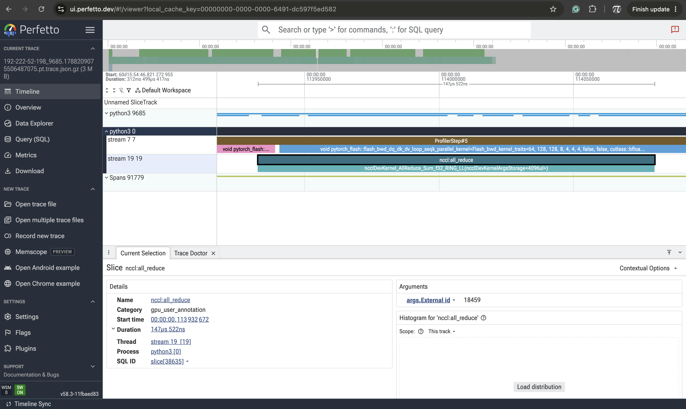
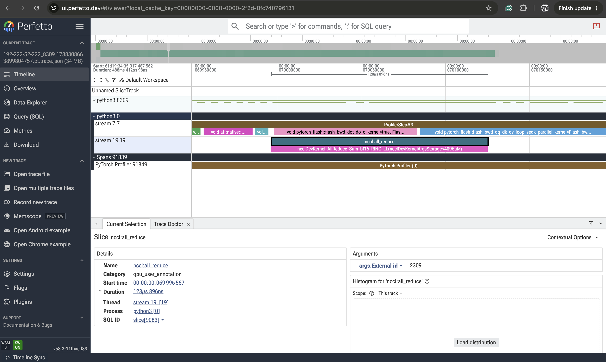

DDP = Distributed Data Parallel Processing

Idea: we take a bunch of training data, split it across multiple gpus, the gpus train on that data, then
the model averages the results of training across multiple gpus. Rather than train the same data for
all gpus, we split it amongst each gpu, making training go by faster.

# mini-training-runtime

A small, reproducible training loop for a byte-level GPT. The point is the runtime,
not the model: deterministic batching, seeded initialization, and append-only metrics
so two runs that differ only in a hyperparameter produce comparable curves.

## Layout

```
mini-training-runtime/
  minirt/
    __init__.py      # empty
    model.py         # TinyGPT
    data.py          # deterministic batcher
    utils.py         # seeding, logging
  train.py           # entry point
  hello_dist.py      # distributed smoke test
  runs/              # metrics output (gitignored)
  README.md
  requirements.txt
```

## Reproducibility

Batches are a pure function of `(seed, split, step)`: step 40 draws the same windows on
every run, machine, and process, regardless of global RNG state or how many batches came
before it. Evaluation draws from a step range far past the training stream, so adding an
eval pass never perturbs the training batches.

`set_seed` covers python, numpy, and torch. `--deterministic` additionally pins cuDNN and
cuBLAS to deterministic kernels for bit-identical runs on the same hardware, at some cost
in throughput.

## Output

Each run writes `runs/<run-name>/`:

- `config.json` — model config, data source, and the full arg namespace
- `metrics.jsonl` — one JSON object per logged step
- `ckpt.pt` — only with `--save-checkpoint`

```python
import pandas as pd
df = pd.read_json("runs/baseline/metrics.jsonl", lines=True)
df.dropna(subset=["val_loss"]).plot(x="step", y=["train_loss", "val_loss"])
```

JSONL is append-only and flushed per step, so an interrupted run still leaves everything
logged up to the kill.

## Model

`TinyGPT` is a pre-norm decoder-only transformer: learned token and position embeddings,
causal attention via `scaled_dot_product_attention`, GELU MLP, tied input/output
embeddings, and GPT-2 scaled init on residual projections. Vocabulary is raw bytes
(256 tokens), so any UTF-8 file works with no tokenizer to train or ship.

Defaults — 4 layers, 4 heads, 128-dim, 128-token context — are ~0.8M non-embedding
parameters and train in a couple of minutes on CPU.


## Status

| Milestone | Description | State |
|---|---|---|
| M0 | Single-process baseline | done |
| M1 | Distributed hello-world | done |
| M2 | Naive DDP (per-parameter all-reduce) | done |
| M3 | GPU port + scaling efficiency baseline | done |
| M4 | Gradient bucketing | done |
| M5 | Compute/comm overlap | done |
| M6 | Deterministic checkpoint/resume | done |
| M7 | Profiling pass + benchmark table | done |
| M8 | bf16 gradient reduction | done |
| M9 | ZeRO-1 optimizer state sharding | done |


## M0 - Single-process baseline

Reference implementation and correctness oracle for everything that follows.

- `TinyGPT`: causal transformer (4 layers, 4 heads, d_model 128, vocab 256),
  written from scratch on `F.scaled_dot_product_attention`.
- Synthetic corpus from a first-order Markov source with Dirichlet-sampled
  transitions. Structured enough that loss falls well below `ln(256) = 5.545`,
  which proves the model is learning rather than memorizing noise.
- `Batcher`: deterministic index-permutation sampler. Data order is a pure
  function of `(seed, pos)`, and `pos` is a single integer - this is what makes
  bit-exact checkpoint resume possible in M6.
- Throughput measured after a warmup window, excluding startup and allocator
  warmup from the timing.

Result (M2 Pro, CPU, batch 32, seq 128):

| Steps | Start loss | End loss | Throughput |
|---|---|---|---|
| 200 | 5.64 | 4.78 | ~60k tok/s |
| 2000 | 5.64 | 3.70 | ~60k tok/s |

Random-guess baseline is `ln(vocab_size) = 5.545`.

Summary: 
Built the reference training run: a 4-layer transformer (TinyGPT), a synthetic corpus with
learnable structure, a deterministic batcher, and a loop that logs loss and tokens/sec after
a warmup window

Result: loss fell 5.64 → 4.78 over 200 steps, and → 3.70 over 2000. Random guessing would sit at
5.545, so the model is genuinely learning. ~60–68k tok/s on your M2 Pro CPU. This run is the correctness oracle for everything after it.

## M1 - Distributed hello-world

Minimal verification that collective communication works before any training
code depends on it.

Each rank builds a one-element tensor holding its own rank and calls
`all_reduce` with the default SUM op. Every rank should converge on
`N(N-1)/2`.

    ./run_dist.sh 2 hello_dist.py   # all ranks -> 1.0
    ./run_dist.sh 4 hello_dist.py   # all ranks -> 6.0

Two properties this establishes, both load-bearing later:

- `all_reduce` is **in-place**. M4's bucketing depends on this - flatten
  gradients into one contiguous buffer, reduce the buffer, copy back out.
- **Every rank ends with the same value.** Reduce *and* broadcast. This is why
  data-parallel training needs no parameter server: all ranks independently
  arrive at identical gradients, so `opt.step()` keeps their weights in sync.

Summary: start a process group, have each rank make a tensor holding its own rank number, all-reduce, print

Result: 2 ranks → both printed 1.0, 4 ranks → all printed 6.0. Confirmed the processes can find each other
and communicate. Also there's a macOS IPv6 rendezvous hang (startup handshake where separate processes find
each other and agree they're one job), which is why run_dist.sh exists.

### macOS note

`torchrun` hangs on rendezvous on macOS - c10d resolves the master address to
IPv6 loopback (`::1`), and the reverse lookup fails. `run_dist.sh` pins gloo to
`lo0`, forces an IPv4 literal master address, and disables the libuv TCPStore.

## M2 - Naive DDP

Data-parallel training written directly against `torch.distributed`. No
`DistributedDataParallel`.

Four pieces:

1. **Identical initialization** - `dist.broadcast(param.data, src=0)` for every
   parameter before training. Same-seed init would work here, but broadcasting
   is what makes correctness independent of seed alignment.
2. **Data sharding** - all ranks build the same permutation from the same seed,
   then each takes `[rank::world_size]` of every chunk. No rank sees another
   rank's samples.
3. **Gradient averaging** - after `backward()`, `all_reduce` each parameter's
   gradient and divide by `world_size`. The divide is not optional: `all_reduce`
   sums, and summed gradients mean an effective learning rate `world_size` times
   too large.
4. **Rank-0-only logging** - with the reported loss itself all-reduced, so the
   logged value is the global mean rather than one rank's local view.

### Correctness

The single-process run is the oracle. Same global batch, split two ways:

    python train.py --steps 200 --batch-size 64                # 1 rank  x 64
    ./run_dist.sh 2 train_ddp.py --steps 200 --batch-size 32   # 2 ranks x 32

| Step | 1 rank x 64 | 2 ranks x 32 |
|---|---|---|
| 10 | 5.6270 | 5.6270 |
| 100 | 5.0436 | 5.0436 |
| 200 | 4.5645 | 4.5645 |

Identical to four decimals at every logged step. Gradient averaging over two
shards of 32 is algebraically the mean over 64; at this model size the
reduction order happens to agree bit-for-bit too.

Note `--batch-size` is **per-rank** in `train_ddp.py`. Global batch is
`batch_size x world_size`.

### Throughput: the "before" number

| Config | Throughput |
|---|---|
| 1 rank x 64 | ~68k tok/s |
| 2 ranks x 32 | ~22k tok/s |

Twice the processes, a third of the throughput. Three causes, two of which are
the point of the next milestones:

- Two processes contending for one laptop's cores at `OMP_NUM_THREADS=1`
  (an artifact of local CPU testing; disappears on real multi-GPU hardware).
- **~30 separate `all_reduce` calls per step**, one per parameter tensor. Each
  carries fixed latency overhead, and this model is small enough that the
  overhead dominates the bytes moved. -> M4 (bucketing).
- **Communication runs after backward completes.** Compute sits idle waiting
  for the sync. -> M5 (overlap).

This is the baseline the rest of the project is measured against.

Summary: Wrote data-parallel training from scratch: broadcast weights from rank 0, shard the data by rank, then after each backward pass all-reduce every gradient and divide by world size. No DistributedDataParallel.

2 Results, 1 good and 1 bad:

Correctness: 2 ranks × batch 32 produced identical loss to four decimals against 1 rank × batch 64, at every logged step. Your DDP is mathematically exact.

Throughput: 68k → 22k tok/s. Slower with more processes. Three causes — CPU contention (a local-testing artifact), ~30 separate all-reduce calls per step where latency dominates, and communication running only after backward finishes while compute sits idle.

## M3 - GPU scaling

Benchmarked on 4x H100 80GB SXM5 (Lambda Cloud), PyTorch 2.7, NCCL backend.
Model: 12-layer transformer, d_model 768, 12 heads, seq_len 512, vocab 512
(~86M parameters). bf16 autocast, 300 steps, 290 timed after warmup.

Weak scaling - per-rank batch held at 32, rank count varied:

| Ranks | Global batch | Throughput | Scaling efficiency |
|---|---|---|---|
| 1 | 32 | 445k tok/s | 1.000 |
| 2 | 64 | 861k tok/s | 0.968 |
| 4 | 128 | 1,715k tok/s | **0.963** |

96% of linear at 4 GPUs.

Throughput is reported globally: rank 0 measures its own tokens/sec and
multiplies by world size. This assumes ranks progress at equal rates, which
collectives enforce approximately but which does hide stragglers by
construction.

At per-rank batch 64, 4 ranks reach **1,941k tok/s** - 13% above batch 32,
since larger batches amortize per-step overhead better on hardware this fast.

### Precision

| Config (4 ranks) | Throughput |
|---|---|
| bf16 | 1,715k tok/s |
| fp32 | 313k tok/s |

5.5x. Larger than the 2x that halved bytes alone would suggest: bf16 matmuls
dispatch to tensor cores, while fp32 without TF32 enabled runs on the general
FP32 path.

### MFU

At ~86M parameters and roughly 6N FLOPs per token, 1,941k tok/s corresponds to
approximately 1.1 PFLOP/s across four GPUs, or ~28% of the 989 TFLOP/s dense
bf16 peak per H100. Reasonable for a model this small; MFU improves with model
size as matmuls grow relative to fixed per-step costs.

## M4 - Gradient bucketing

M2 issued one `all_reduce` per parameter tensor - roughly 50 collectives per
step. Each collective carries fixed overhead independent of payload size:
launch cost, cross-rank synchronization, protocol handshake. For a tensor
holding a few thousand floats, that overhead exceeds the cost of moving the
bytes. The work is **latency-bound**, not bandwidth-bound.

Bucketing trades many small collectives for few large ones. Parameters are
partitioned into ~25MB groups at startup; each step flattens a bucket's
gradients into one contiguous buffer, all-reduces the buffer once, divides by
world size, and copies the results back into the individual `.grad` tensors.

Buckets are assembled in **reverse parameter order**. This is irrelevant here -
M4 synchronizes after `backward()` has fully completed - but backward produces
gradients last-layer-first, so reverse ordering is what allows M5 to fire a
bucket's collective as soon as that bucket is ready.

Partitioning is computed at construction, before any gradient exists, since it
depends only on parameter shape and dtype. M5 requires bucket membership to be
known in advance so hooks can test readiness.

### Correctness

    python train.py --steps 200 --batch-size 64                # 1 rank  x 64
    ./run_dist.sh 2 train_ddp.py --steps 200 --batch-size 32   # 2 ranks x 32

Identical to four decimals at every logged step, matching M2 and the
single-process baseline. Flattening changes the order of floating-point
summation, so exact agreement is not guaranteed in general - it holds at this
model size.

### Throughput

| Config | Collectives/step | Throughput |
|---|---|---|
| M2, per-parameter | ~50 | ~21.6k tok/s |
| M4, 25MB buckets | 1 | ~23.6k tok/s |

About 9%. Smaller than the 50x reduction in collective count suggests, and the
reason is the measurement environment rather than the optimization: gloo over
loopback has low per-call latency - no network, no PCIe, just memory copies
between processes on one machine - so the overhead being eliminated is small in
absolute terms. The dominant cost here is two Python processes at
`OMP_NUM_THREADS=1` contending for one laptop's cores during forward and
backward, which bucketing does not address.

The optimization targets a cost this environment barely has. The meaningful
measurement is multi-GPU with NCCL, where per-collective overhead is
substantially higher relative to compute, and is deferred to the M3 benchmark
session.

## M5 - Compute/communication overlap

M4 still serializes the step: backward runs to completion, then communication
starts. During the all-reduce the compute units idle; during backward the
interconnect idles.

    [============ backward ============][== all_reduce ==][step]

But the last layer's gradient is ready long before the first layer's. Firing
each bucket's collective the moment that bucket is complete lets communication
run underneath the remaining backward pass:

    [============ backward ============][wait][step]
           [== b3 ==][== b2 ==][== b1 ==]

Communication time does not shrink. It hides.

### Mechanism

**Readiness tracking.** Each parameter gets a
`register_post_accumulate_grad_hook` that decrements its bucket's pending
count. Counting rather than assuming an order matters: hooks fire in backward
order, which is close to reverse parameter order but not guaranteed to match
it.

**Async dispatch.** When a bucket's count reaches zero, its gradients are
flattened and passed to `dist.all_reduce(..., async_op=True)`, which returns a
`Work` handle immediately. Backward continues while the collective proceeds.

**Deferred synchronization.** Before `opt.step()`, every outstanding handle is
waited on, then each buffer is divided by world size, unflattened, and copied
back into `.grad`. The optimizer must never read a gradient still in flight.

State resets at the end of every step - pending counts restored, handle list
cleared - or step 2 would see every bucket already "ready" and fire nothing.

Bucket ordering must be identical across ranks. Collectives are matched by call
order, not by identity, so ranks reducing buckets in different orders deadlock
rather than error. Deterministic partitioning from M4 is what guarantees this.

### Correctness

Losses identical to four decimals against the single-process baseline at every
logged step, at both bucket sizes tested.

### Throughput, and why it doesn't improve here

| Config | Throughput |
|---|---|
| M2, per-parameter all-reduce | ~21.6k tok/s |
| M4, 25MB buckets, no overlap | ~23.6k tok/s |
| M5, 25MB buckets, overlapped | ~23.9k tok/s |
| M5, 1MB buckets, overlapped | ~21.3k tok/s |

Two results, both expected on this hardware.

**At 25MB the overlap has nothing to hide behind.** TinyGPT's gradients total
~6MB, so the entire model is one bucket, and a single bucket cannot fire until
its last gradient arrives - which is when backward ends. The mechanism is
correct and has no opportunity to act.

**At 1MB, more buckets made it slower, not faster.** Two effects compound.
More buckets means more collectives, which reintroduces the per-call latency
M4 removed. And gloo's `async_op` on CPU does not provide true background
progress: there is no copy engine, so a collective advances only while the
process is executing inside gloo. "Overlap" degrades into interleaved work
competing for the same cores as backward. The per-interval throughput bears
this out, decaying from ~24k to ~10k over the run rather than holding steady.

This is the bucket-size tension made concrete: **larger buckets amortize
latency but eliminate overlap; smaller buckets enable overlap but multiply
latency.** On CPU with gloo the latency term dominates so completely that
overlap cannot win at any size. The technique is a GPU optimization -
NCCL collectives run on dedicated copy engines and make real progress
concurrently with SM compute. That asymmetry is not observable on this
hardware.

The M3 benchmark session therefore has a question attached, not just numbers to
collect: sweep `--bucket-mb` across 1 / 5 / 25 / 100 under NCCL and locate where
the curve actually peaks.

### Known gaps

- Flat buffers are allocated per bucket per step. Production DDP preallocates
  once at construction and reuses.
- No gradient accumulation support - every backward triggers a sync.

## M6 - Deterministic checkpoint/resume

The bar is not "training continues after a restart." It is: **a run that is
interrupted and resumed produces bit-identical results to a run that was never
interrupted.** Same weights, same optimizer moments, same loss at every step.

"Close enough" is easy and proves nothing. Bit-exactness is what forces every
piece of nondeterministic state to be captured - any divergence is proof that
something was dropped.

### What is saved

| Component | Why it matters if lost |
|---|---|
| model `state_dict` | the obvious one |
| optimizer `state_dict` | AdamW's per-parameter first and second moments; without them the first steps after resume are effectively unconditioned |
| RNG states (torch, numpy, python, cuda) | anything stochastic - dropout, shuffling, augmentation - diverges immediately |
| batcher position | determines which samples come next; without it, data is re-shown or skipped |
| step counter | schedule position |

The batcher is the piece that usually blocks this. Most dataloaders have no
notion of position and cannot resume mid-epoch without re-shuffling. This one
stores a single integer: the permutation is derived purely from `seed`, so
`(seed, pos)` fully determines the stream. That was a deliberate M0 decision
made for this milestone.

### Atomic writes

Checkpoints are written to `path.tmp` and then moved with `os.replace`, which
is atomic on POSIX. A crash during the write leaves the previous checkpoint
intact rather than a truncated file - which matters, since crashing is the
exact scenario this feature exists to survive.

### Verification

`verify_resume.py` runs the comparison end-to-end:

1. Reference run, 100 steps uninterrupted, final checkpoint saved.
2. Partial run, 50 steps, checkpoint saved.
3. Resumed run, loads that checkpoint, trains to step 100, final checkpoint saved.
4. Every tensor in both the model and optimizer state dicts compared with
   `torch.equal`.

    $ python verify_resume.py
    ...
    PASS

Model weights **and** optimizer state are bitwise identical. Losses match at
every logged step:

| Step | Uninterrupted | Killed at 50, resumed |
|---|---|---|
| 60 | 5.3342 | 5.3342 |
| 70 | 5.2946 | 5.2946 |
| 80 | 5.2335 | 5.2335 |
| 90 | 5.1913 | 5.1913 |
| 100 | 5.1311 | 5.1311 |

The comparison is recursive over nested structures, since
`optimizer.state_dict()` mixes dicts, lists, tensors, and scalars.
Distributed resume was also verified at `world_size=2` with matching losses.

### Note on the warmup window

Throughput timing originally triggered at a fixed step index, which never fired
on a resumed run starting past that point. The trigger is now relative to
`resume_step`, so a resumed run measures its own warmup window.

### Known gaps

- Checkpoints are written by rank 0 only, as a single file. Sharded checkpoint
  writing across ranks is not implemented.
- Saving is synchronous - training blocks until the write completes.
- No retention policy; each run keeps one checkpoint, overwritten in place.

## M7 - Profiling

`--profile` wraps the training loop in `torch.profiler` with a
`wait=1, warmup=2, active=N` schedule, so the trace excludes allocator warmup
and cuDNN autotuning. Rank 0 only - profiling every rank multiplies overhead
without adding information.

### Overlap, confirmed in the trace



Two CUDA streams, one training step (`ProfilerStep#5`, 4.209 ms total):

- **stream 7** - compute. Backward kernels run continuously:
  `flash_bwd_dq_dk_dv_loop_seqk_parallel_kernel`, `nvjet_tst_*` matmuls,
  `GammaBetaBackwardCUDAKernel`, `layer_norm_grad_input_kernel`.
- **stream 19** - communication. `ncclDevKernel_AllReduce_Sum_f32_RING_LL`,
  147.5 us per call.

The all-reduce begins and completes *inside* the span of a single backward
flash-attention kernel. The collective is not merely adjacent to compute - it
is fully hidden by it. Across the step, nccl slices appear at several distinct
points rather than clustered at the end, which is the per-bucket hook dispatch
firing as each bucket completes.

This is the direct evidence for M5. On CPU with gloo the mechanism was correct
but unobservable; on NCCL it does what it was built to do.

### Bucket size

The question M5 left open, swept at 4 ranks:

| Bucket size | Throughput |
|---|---|
| 1 MB | **1,751k tok/s** |
| 5 MB | 1,742k tok/s |
| 25 MB | 1,721k tok/s |
| 100 MB | 1,723k tok/s |

**Smaller buckets win here - the inverse of the CPU result.** On gloo,
smaller buckets were slower: more collectives meant more per-call latency, and
`async_op` gave no real background progress without a copy engine. On NCCL the
collectives execute on a dedicated stream concurrently with compute, so more
buckets means more overlap opportunity, and per-call overhead is low enough not
to consume the gain.

The spread is ~1.8%, small but consistent and well above run-to-run noise
(~0.3%). The same knob points in opposite directions on the two backends, which
is the point: bucket size trades latency amortization against overlap
opportunity, and which term dominates is a property of the hardware, not the
algorithm.

### Observation from the trace

Gradients are all-reduced in **fp32** (`AllReduce_Sum_f32`) even though the
forward pass runs in bf16 - autocast keeps master weights and gradients in full
precision. Communication therefore moves twice the bytes a bf16 reduction
would. Reducing in bf16, or compressing gradients, is unexplored here.

## M8 - bf16 gradient reduction

The M7 trace showed `ncclDevKernel_AllReduce_Sum_f32` - gradients were being
reduced in fp32 even though the forward pass ran in bf16. Autocast keeps master
weights and gradients in full precision, so the collective was moving twice the
bytes it needed to. `--comm-dtype bf16` casts each flattened bucket to bf16
before the all-reduce; the copy back into `.grad` restores fp32 implicitly.

### Result: no throughput change

Measured on 2x H100, batch 64/rank, 300 steps:

| Gradient reduction | Throughput |
|---|---|
| fp32 | 969,226 tok/s |
| bf16 | 964,688 tok/s |

Halving communication volume made throughput 0.5% *worse* - within noise, and
in the wrong direction.

This is the expected outcome given M7. The trace had already shown the
all-reduce running on a separate stream, fully hidden inside the backward pass.
An operation that is not on the critical path cannot be made faster by
shrinking it. What the change does add is one cast kernel per bucket per step -
16 extra launches - which is where the 0.5% goes.

### The collective did shrink



The kernel is now `ncclDevKernel_AllReduce_Sum_bf16_RING_LL` at 128.9 us,
against `..._Sum_f32_RING_LL` at 147.5 us in the M7 trace. The change reached
NCCL and is doing what it claims.

Two caveats on that comparison. The traces differ in rank count (2 vs 4), so it
is suggestive rather than controlled. And 13% is far short of the ~50% that
halving payload would predict - at roughly 5MB per bucket the collective is
latency-bound, not bandwidth-bound, so fixed ring-traversal and launch costs
dominate the transfer time. That is consistent with the throughput result.

### Convergence

Loss tracks fp32 to 3-4 decimals across 300 steps (4.7065 / 4.7065 at step 50;
0.8025 / 0.8067 at step 300). Reduced-precision gradient reduction does not
measurably affect convergence at this scale.

### What this establishes

The optimization is real, correct, and useless here - and the profiler said so
before the benchmark did. Communication is not the bottleneck in this
configuration; compute is. bf16 reduction

## M9 - ZeRO-1 optimizer state sharding

Under plain DDP every rank holds a full copy of AdamW's state - first and second
moments, fp32, one pair per parameter - and computes an identical optimizer
update. For an 86M-parameter model that is ~660 MiB replicated on every GPU to
produce the same answer N times.

ZeRO-1 partitions it. Parameters are split into `world_size` disjoint shards;
each rank builds its optimizer over its own shard only, steps just those
parameters, and then the updated weights are broadcast from their owner so every
rank ends the step with an identical model.

### Implementation

**Partitioning** is greedy by element count rather than parameter count - the
embedding and output head dwarf the LayerNorms, so an even split of *tensors*
would be a badly uneven split of *state*. Ties break by index, making the
partition a pure function of parameter order and shape, and therefore identical
on every rank without any communication.

**Gradient reduction is unchanged.** All ranks still all-reduce every gradient;
Stage 1 shards only optimizer state. (Sharding gradients via reduce-scatter is
Stage 2.)

**Parameter sync** after the local step is bucketed, for the same reason M4
bucketed gradients. The naive version issues one broadcast per parameter - ~50
collectives per step:

| Parameter sync | Throughput (2 ranks, CPU) |
|---|---|
| Per-parameter broadcast | 37.9k tok/s |
| Bucketed by owner | 46.2k tok/s |

22% from collapsing ~50 collectives into 2. Every rank flattens each owner's
shard unconditionally - the receiving buffers hold stale values, but the shapes
must match for the broadcast to land - then all ranks copy back.

Two invariants this depends on, both worth stating because violating either
deadlocks rather than errors:

- All ranks iterate owners in the same fixed order.
- `zero_grad` must clear gradients for *all* parameters, not just the local
  shard. The wrapped optimizer only knows about its own shard, so delegating
  blindly leaves ~`(N-1)/N` of the gradients accumulating across steps - and
  the bucketer would then all-reduce stale values.

### Correctness

Losses identical to four decimals against the plain-DDP baseline, on CPU/gloo
and on GPU/NCCL. Relocating where optimizer state lives does not change the
math.

### Memory

Measured on 2x A6000 48GB, 86M parameters, 100 steps. (Throughput figures
elsewhere in this README are 4x H100; this table is different hardware.)

| Batch/rank | DDP peak | ZeRO-1 peak | Saved | % of peak |
|---|---|---|---|---|
| 32 | 6.70 GiB | 6.37 GiB | 0.33 GiB | 4.9% |
| 4 | 2.16 GiB | 1.82 GiB | 0.34 GiB | **15.7%** |

**The absolute saving is constant; the percentage is not.** 0.33 GiB is half of
AdamW's ~660 MiB of fp32 moments, which is exactly `state x (1 - 1/N)` at
`N = 2`. Cutting the batch 8x shrank activations proportionally while optimizer
state stayed fixed, so the same saving went from 5% of peak to 16%.

That ratio is the whole story of when ZeRO-1 is worth it. It shards a quantity
that scales with **model size**, against a memory budget usually dominated by
activations, which scale with **batch size and sequence length**. At batch 32
here, activations are ~90% of peak and ZeRO-1 barely registers. The technique
earns its cost when the model is large relative to the batch - which is the
regime frontier training actually operates in, and the reason the paper targets
billion-parameter models rather than 86M ones.

### Cost

| Config | Throughput (2x A6000) |
|---|---|
| DDP | 203k tok/s |
| ZeRO-1 | 186k tok/s |

8%, paid for the parameter broadcast that DDP does not need. At this model size
that is a bad trade; at a size where optimizer state dominates memory, it buys
the ability to train at all.

### Known gaps

- Stage 2 (gradient sharding via reduce-scatter) and Stage 3 (parameter
  sharding) are not implemented.
- Checkpointing under ZeRO is untested: each rank holds a different shard of
  optimizer state, so the M6 bit-exactness test does not apply as written.
  Gathering shards to rank 0 at save time would make checkpoints
  world-size-independent.
- The parameter broadcast is not overlapped with anything.

## Setup

    conda create -n mtr python=3.12 -y
    conda activate mtr
    python -m pip install -r requirements.txt

    python train.py --steps 2000          # single process
    ./run_dist.sh 2 hello_dist.py         # distributed smoke test